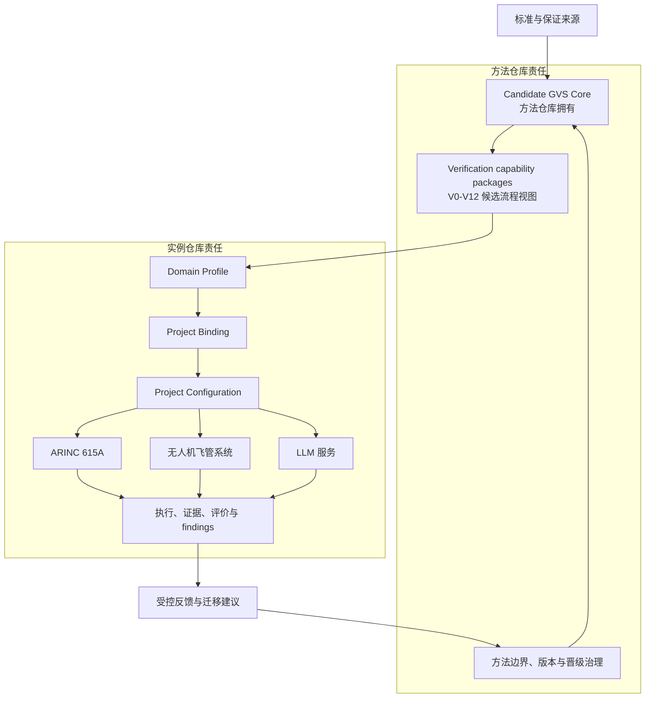

# Complex System Verification Assurance Framework

本仓库研究一个产品无关、证据可追溯且可被实例检验的复杂系统 Verification Assurance 方法框架。主要工程产物是 **Candidate Generic Verification Suite (GVS) Core**；它组织 Verification Basis、Obligation、Strategy、Case/Procedure、Observation、Result、Evidence、Argument、Claim、Gate 与变更影响之间的受控关系，但不预设 SysML、API、数据库 schema、特定工具或可执行软件原型。

本 README 是仓库唯一的人类可读当前状态入口。机器可读的对应状态位于 [`project-status.json`](project-status.json)，两者的受控区块由同步脚本保持一致。

## 为什么开展这项研究

复杂系统验证同时受到通用生命周期标准、行业保证要求、项目工程方法和工具实现约束。研究需要持续区分：标准明确要求什么、跨来源可以稳健推广什么、实例只能局部说明什么、以及哪些部分仍属于待证伪的框架创新。研究问题、范围与创新声明分别见：

- [`research_questions.md`](docs/00_overview/research_questions.md)
- [`research_scope.md`](docs/00_overview/research_scope.md)
- [`innovation_statement.md`](docs/00_overview/innovation_statement.md)

## 方法与实例的开发架构



Profile、Binding 和 Configuration 是实例侧的受控投影；实例结果只能形成有边界的评价证据，不能凭单一实例自动改变架构成熟度或关闭 RQ8。

<!-- project-status:start -->
## 当前开发图景

| 维度 | 当前受控状态 |
|---|---|
| 仓库角色 | Generic verification methodology / Candidate GVS Core owner |
| 研究阶段 | normative-foundation research late stage |
| 架构成熟度 | `OPEN-CANDIDATE` |
| 历史研究基线 | `research-baseline/v0.2` @ [`357ad14ffc4e`](https://github.com/ZhangChi0727/complex-system-verification-assurance/commit/357ad14ffc4e59abd071cb794912eb949a6ae6cf) |
| Candidate GVS Core 方法定义 | `Candidate GVS Core 0.3` @ [`48dd8232b7ef`](https://github.com/ZhangChi0727/complex-system-verification-assurance/commit/48dd8232b7efe6b0dba3fcb75dfc154d034d2b0b) |
| ARINC 第三次握手 | `COMPLETE`；实例确认版本 `RB-2026-001-v4.3.1` / `v4.3.1` |
| 跨仓库兼容性 | `REVIEWED-COMPATIBLE-WITH-QUALIFICATION`，受 Q-01, Q-02, Q-03, Q-04, Q-05, Q-06, Q-07, Q-08, Q-09 限定 |
| 实例状态 | Project Configuration `NOT YET ESTABLISHED`；评价 `NOT-EXERCISED`；RQ8 `OPEN` |
| 当前研究停点 | Task 001 — ISO/IEC/IEEE 15289:2019 |
| 下一实例步骤 | Establish a real Project Configuration, then execute the controlled ARINC evaluation protocol. |

方法仓库拥有 Generic Core、方法边界与治理规则；实例仓库拥有 Profile、Binding、Configuration、执行记录和实例证据。方法定义提交 [`48dd8232b7ef`](https://github.com/ZhangChi0727/complex-system-verification-assurance/commit/48dd8232b7efe6b0dba3fcb75dfc154d034d2b0b) 与兼容性处置提交 [`c02330d21fe2`](https://github.com/ZhangChi0727/complex-system-verification-assurance/commit/c02330d21fe2d3e89e7e2d6352872d52461a6dda) 是不同的不可变身份，不得互换。

## 本次集成增量

**Lean project-management control surface**

- Make the root README the sole human-readable current-status surface.
- Add a machine-readable project status and a deterministic README synchronizer.
- Retire HANDOFF files and replace lifecycle-specific validator constants with governed data.
- Record completion of the ARINC 615A v4.3.1 third handshake without creating a method baseline or tag.

保持不变的边界：

- Candidate GVS Core semantics and V0-V12 remain unchanged.
- Normative research conclusions, gap dispositions and research-task content remain unchanged.
- Atomic baselines, change requests, reviews and historical evidence remain immutable.
- Project Configuration is NOT YET ESTABLISHED; instance evaluation is NOT-EXERCISED; RQ8 remains OPEN.

跨仓库最终状态：方法仓库评估的来源是 `RB-2026-001-v4.3` / `v4.3` @ [`523d42bf03a1`](https://github.com/ZhangChi0727/arinc-615a-conformance/commit/523d42bf03a1135b3d63a00bfb47d3b879d3927e)；ARINC 仓库以 `RB-2026-001-v4.3.1` / `v4.3.1` @ [`72ca6df88cb8`](https://github.com/ZhangChi0727/arinc-615a-conformance/commit/72ca6df88cb8def5221a8fa54e69551f9e7041db) 确认该处置。此次确认不创建方法仓库 baseline 或 tag。

## 当前停点

`Task 001` — **ISO/IEC/IEEE 15289:2019**：Execute the clause-level information-item study and stop at independent review.

当前不得越过的结论边界：

- No information model, schema, metamodel, lifecycle state machine or automation interface is frozen.
- No Project Configuration is established for the ARINC instance.
- No instance-evaluation or multi-domain validation claim is earned.
- No general scalability or RQ8 closure claim is earned.

## 下一步开发计划

- Execute Task 001 against the controlled ISO/IEC/IEEE 15289:2019 source.
- Prepare and independently review the clause study before promoting any 15289-dependent conclusion.
- After that gate, continue the dependency-driven research-task queue and later Task 022 synthesis.
- In parallel, plan bounded ARINC instance evaluation without treating it as architecture validation or RQ8 closure.
<!-- project-status:end -->

## 按角色继续阅读

| 角色 | 建议入口 | 用途 |
|---|---|---|
| 一般读者 | [`research_scope.md`](docs/00_overview/research_scope.md) → [`ARCHITECTURE.md`](ARCHITECTURE.md) | 理解研究边界、方法层次和当前成熟度 |
| 研究人员 | [`research_tasks/README.md`](docs/01_normative_foundation/research_tasks/README.md) → [`standards_baseline.md`](docs/01_normative_foundation/standards_baseline.md) | 从当前停点进入标准研究与独立评审流程 |
| 开发者 | [`CONTRIBUTING.md`](CONTRIBUTING.md) → [`generic_verification_suite_core.md`](docs/02_verification_framework/generic_verification_suite_core.md) | 实施受控增量并守住语义边界 |
| Agent | [`project-status.json`](project-status.json) → [`roadmap.md`](docs/00_overview/roadmap.md) → 具体任务说明 | 读取机器状态、定位下一动作并执行门禁 |

实例集成与第三次握手的耐久记录位于 [`docs/08_validation/`](docs/08_validation/README.md)。研究历史记录保留在各阶段 review、consolidation 与 changelog 文件中；它们不是当前状态入口。

## 研究纪律

1. 标准证据、解释、框架影响和提案必须分层记录。
2. 标准优先于当前框架假设；标准沉默登记为 gap，不得自行补齐或当作新颖性证明。
3. 受版权保护的标准 PDF 仅作本地持证来源，不提交远程仓库。
4. 任何晋级必须满足对应独立评审和迁移门禁；单一实例只产生有边界的实例证据。
5. 每个 PR 必须同时更新 README 的本次增量/停点/下一步与 `project-status.json`，并保持自动同步。

## 本地校验

```powershell
python scripts/sync_project_overview.py --check
python -m compileall -q scripts tests
python -m unittest discover -s tests -v
python scripts/check_repository_integrity.py
git diff --check
```

如需按 `project-status.json` 重建受控 README 区块，运行：

```powershell
python scripts/sync_project_overview.py --write
```

贡献流程、PR 更新门禁和版权边界见 [`CONTRIBUTING.md`](CONTRIBUTING.md)。本项目采用 [MIT License](LICENSE)。
